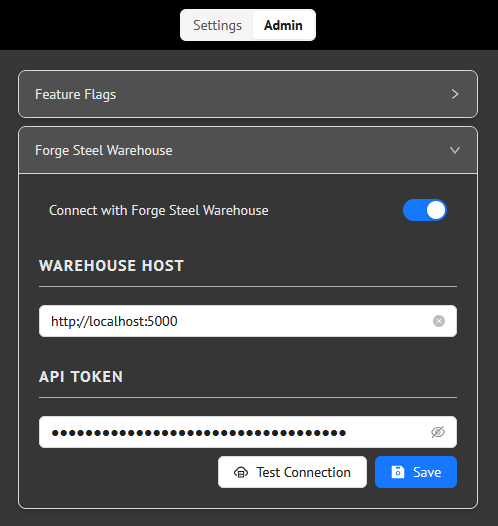
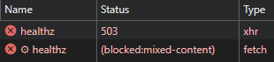
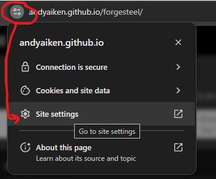
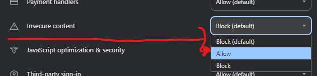
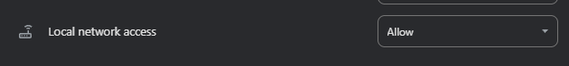

# Forge Steel - Warehouse

A data backend for [Forge Steel](https://andyaiken.github.io/forgesteel/)

Forge Steel Warehouse runs as a container that exposes an api which Forge Steel can use to store your Hero and Sourcebook data *outside* your browser. This means you can share data cross devices, and not worry about a browser update wiping out all of your created characters.

## Usage

These instructions assume a familiarity with docker and the linux command-line.

For wider access to your self-hosted forgesteel-warehouse instance, it is also assumed that you have an understanding of things such as port forwarding and/or proxies, firewall security, etc.

### Prerequisites
- `docker` installed and working
    - `podman` should also work fine, just substitute the relevant command name. But if you're using podman, you almost certainly already know this, so why am I even still writing?
- *(Optional but HIGHLY recommended)* Reverse proxy with SSL setup and configured
- *(Optional - required for remote access)* Routed and secured port access to where the container is running.

### Initial setup and configuration

Pull the latest image from docker hub:
```bash
docker pull veritas1000/forgesteel-warehouse
```

Create a directory on the host machine where the forgesteel-warehouse data and configuration will live. For simplicity, this example will just use the directory `/data/forgesteel`.

The first time you run forgesteel-warehouse, run it interactively like so:

```bash
run --rm -it --name fs-warehouse -p 5000:5000 -v /data/forgesteel:/data veritas1000/forgesteel-warehouse
```

The first time it starts up, it will initialize the database and generate an API key for you, displaying it in the session - **save it someplace secure**! This is how you will connect Forge Steel with your individual warehouse.

### Running with `docker compose`
You can also create a `compose.yaml` file to run forgesteel-warehouse, a basic compose file might look like this:
```yaml
---
services:
  fs-warehouse:
    image: veritas1000/forgesteel-warehouse:latest
    container_name: fs-warehouse
    volumes:
      - ./instance:/data
    ports:
      - 5000:5000
    restart: unless-stopped
```

This will run the service on port `5000`, with the data stored in the `instance` directory under the current dir (this happens to be the default dir that the dev server uses). If you don't change this volume mount, just make sure that `instance` directory exists.

Then, start forgesteel-warehouse by running `docker compose up -d`

#### With external database (postgres)
If you wanted to connect forgesteel-warehouse to an external database instead of using the built-in sqlite db, you could do something like this (use a `postgres:18` image as the db):

```yaml
---
services:
  fs-warehouse:
    depends_on:
      - db
    image: veritas1000/forgesteel-warehouse:latest
    restart: unless-stopped
    volumes:
      - ./data:/data
    ports:
      - 5000:5000
    environment:
      DATABASE_URI: postgresql://fs-warehouse:Super-Secret-ChangeMe@db/fs-warehouse
  db:
    image: postgres:18
    restart: always
    shm_size: 128mb
    environment:
      POSTGRES_USER: fs-warehouse
      POSTGRES_PASSWORD: Super-Secret-ChangeMe
    ports:
      - 5432:5432
```

### Connecting with Forge Steel
- In Forge Steel, go to the **Admin** section under **Settings**.

- Under **Feature Flags**, enter the Feature Flag `Treat Curve`. This will enable the Fore Steel Warehouse settings.

- Then, expand the 'Forge Steel Warehouse' section, and turn on `Connect with Forge Steel Warehouse'.

- Enter the hostname and port for your warehouse instance (if running locally with the dev server or example compose file above, it will be `http://localhost:5000`)

- Enter the API key displayed when you ran the warehouse the very first time.


- At this point, clicking 'Test Connection' should show 'Success!'. You can then save the settings and either follow the prompt to **Reload Forge Steel**, or click the button at the top of the panel to **Transfer Data**.

#### Transferring data into the warehouse
Right now, there is no automatic data migration from the old local Forge Steel storage to the Warehouse, so upon loading Forge Steel while connected to the Warehouse, it will look like all of your data is gone! However, your local data is still there.

To transfer data into the warehouse:
- Go to [the Forge Steel transfer](https://andyaiken.github.io/forgesteel/#/transfer) and follow the instructions on that page.

### Additional users

Running the self-hosted warehouse assumes a single, default user that is created on first start. If you want to add additional users, run the following docker command (replace `fs-warehouse-ct` with the name of your particular running container)

```bash
docker exec -it fs-warehouse-ct python /app/utils/add_user.py
```

The script will add a new user and output the API key for that user, the same way it does for the initial user:

```
****************************************
USER CREATED
Here is your API KEY for connecting with Forge Steel
Save it somewhere safe - IT WON'T BE DISPLAYED AGAIN!

$2$123abcd...aaa

****************************************
```

### Regenerating API keys for users

If for some reason you need to generate a new API key for a user, you can use the `cycle_key.py` helper script. To cycle the key of the default user, run:

```bash
docker exec -it fs-warehouse-ct python /app/utils/cycle_key.py
```

The script will output the new api key to the console.

## Troubleshooting

### 503 mixed-content error when running over HTTP

Is some browsers (such as Chrome), the default secutiry settings block non-HTTPS requests by a page that is itself served over HTTPS. When this happens, you will see an error like `503 Error: Offline` when testing the connection with Forge Steel.


This can be further verified by looking at the network trace in Dev Tools, which will show the specific `blocked:mixed-content` error.



The best solution to this is to get a free HTTPS certificate through something like [Lets Encrypt](https://letsencrypt.org/), but if that is not an option for you, your browser may have a setting to enable insecure content for a particular website (Forge Steel in this case).

In Chrome, this can be done by going to **Site Settings**, and setting **Insecure Content** to `Allow`





If you are hosting your Warehouse instance on your local network and accessing it via IP address instead of hostname, you'll also likely need to enable `Local Network Access` in the Site Settings page as well.



You may also have to reload the app/page several times (including a hard refresh - which in Chrome on Windows is `Ctrl + F5`).

## Development

### Set up python virtual environment
Create  the virtual environment:
```bash
python -m venv .venv
```

Activate the virtual environment:
```bash
. .venv/bin/activate
```

Install dependencies:
```bash
python -m pip install -r requirements.txt
```

Run the api backend in development mode:
```bash
./dev_server.sh
```

### Run tests
```bash
python -m pytest .
```

With coverage:
```bash
python -m pytest --cov --cov-report term
```

### Build container

```bash
docker build -t fs-warehouse -f Containerfile .
```

### Run container

```bash
docker run --rm -p 5000:5000 -v <local-dir>:/data --name fs-warehouse fs-warehouse:latest 
```

### DB migrations
Make the relevant Model changes, then:

```bash
flask --app 'forgesteel_warehouse:init_app()' db migrate -m "Some migration details"
```

### Dependency upgrade

- Update python dependencies
```bash
pip install --upgrade -r requirements.txt
```
- run tests, verify, etc
- freeze deps
```bash
python -m pip freeze > requirements.txt
```

### Version bump

- update `__version__.py` with new version
- commit
- tag commit (in gitlab - or manually as below)
```bash
git tag vX.Y.Z
```
- push tag
```bash
git push origin tag vX.Y.Z
```
- push commit

### Todos

- [x] Rework API key auth
- [x] Improve log formatting
- [x] Add ability to pull secrets from env
- [ ] Add overview/instructions html page to root
- [ ] Add ability to bypass bootstrap
